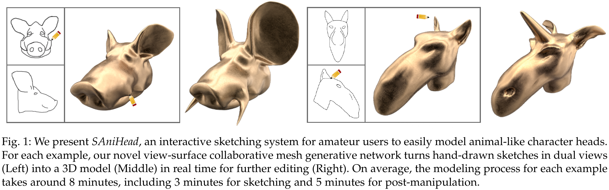

## SAniHead [[Paper]](https://ieeexplore.ieee.org/document/9222121)[[Video]](https://www.youtube.com/watch?v=pxJmNCBKFq8)[[Poster]](figures/poster.jpg)

**SAniHead: Sketching Animal-like 3D Character Heads Using a View-surface Collaborative Mesh Generative Network**  
Dong Du, [Xiaoguang Han](https://mypage.cuhk.edu.cn/academics/hanxiaoguang/),  [Hongbo Fu](http://sweb.cityu.edu.hk/hongbofu/),  Feiyang Wu, [Yizhou Yu](https://i.cs.hku.hk/~yzyu/), [Shuguang Cui](https://sse.cuhk.edu.cn/en/faculty/cuishuguang), [Ligang Liu](http://staff.ustc.edu.cn/~lgliu/)  
In IEEE Transactions on Visualization and Computer Graphics (TVCG), 2020.  

