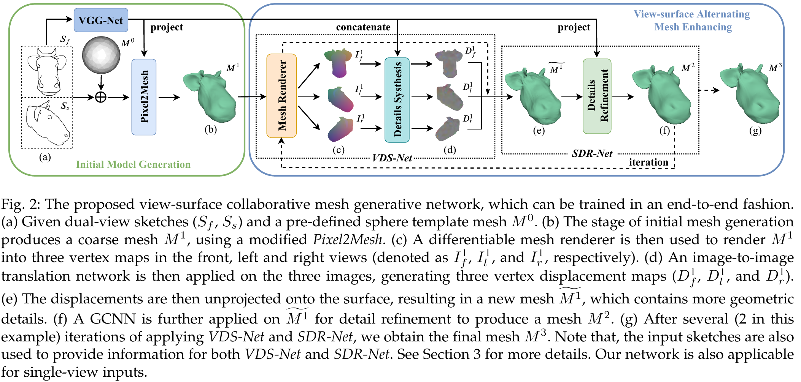
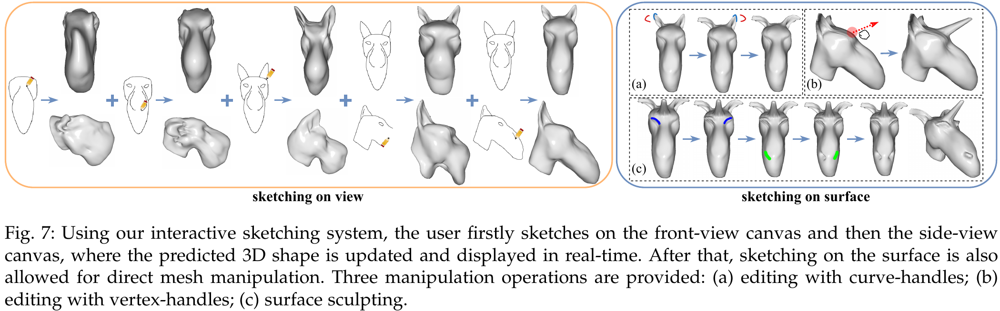

## SAniHead [[Paper]](https://ieeexplore.ieee.org/document/9222121)[[Video]](https://www.youtube.com/watch?v=pxJmNCBKFq8)[[Poster]](figures/poster.jpg)

**SAniHead: Sketching Animal-like 3D Character Heads Using a View-surface Collaborative Mesh Generative Network**  
Dong Du, [Xiaoguang Han](https://mypage.cuhk.edu.cn/academics/hanxiaoguang/),  [Hongbo Fu](http://sweb.cityu.edu.hk/hongbofu/),  Feiyang Wu, [Yizhou Yu](https://i.cs.hku.hk/~yzyu/), [Shuguang Cui](https://sse.cuhk.edu.cn/en/faculty/cuishuguang), [Ligang Liu](http://staff.ustc.edu.cn/~lgliu/)  
In IEEE Transactions on Visualization and Computer Graphics (TVCG), 2020.  


---

### Install

#### sanihead_end2end 
This implementation has been tested on Ubuntu 18.04, using Python 2.7.12, TensorFlow-gpu 1.13.2, TFLearn 0.5.0, CUDA 10.0, etc.  



To train the code, please install several external libraries.

1. Chamfer Distance  
Please make and replace the "cd_dist_so.so" file for the calculation of Chamfer distance. The source code and introduction can be found from [Pixel2Mesh](https://github.com/nywang16/Pixel2Mesh/tree/master/external). 

2. [DIRT](https://github.com/pmh47/dirt)  
Comparied with the source code of DIRT, we add the orthogonal projection function for our mesh rendering. The modified code can be found in [dirt](ui/Library/dirt). Please refer to [DIRT](https://github.com/pmh47/dirt) to install it. 

The dataset can be found in this [link](https://mailustceducn-my.sharepoint.com/:f:/g/personal/dongdu_mail_ustc_edu_cn/EnzdL0Jpqi1Mqr2gzs31pbEBdm-vTamzj4WFqYCpr6xcaw?e=Mu1HPJ). We also provide pre-trained [models](https://mailustceducn-my.sharepoint.com/:f:/g/personal/dongdu_mail_ustc_edu_cn/EplJrKEahntMvynmR3KYavcB68f5aC5I_rQplLc3L4NFfg) for the fine-tuning or testing. You can download them and put them in the directory of "sanihead_end2end". 


#### ui
We design the user interface for real-time sketch-based animal-head modeling. It is built on Ubuntu 18.04, using Qt Creator 5.9.5.  The [ependencies](ui/dependencies.txt) are also given. To run the demo, a GPU with more than 8 GB memory is required. 




---

### Citation
If you find our work helpful, please consider citing
```
@article{du2020sanihead,
  title={SAniHead: Sketching Animal-like 3D Character Heads Using a View-surface Collaborative Mesh Generative Network},
  author={Du, Dong and Han, Xiaoguang and Fu, Hongbo and Wu, Feiyang and Yu, Yizhou and Cui, Shuguang and Liu, Ligang},
  journal={IEEE Transactions on Visualization and Computer Graphics},
  year={2020},
  publisher={IEEE}
}
```

---

### License
SAniHead is relased under the MIT License. See the [LICENSE file](LICENSE ) for more details.